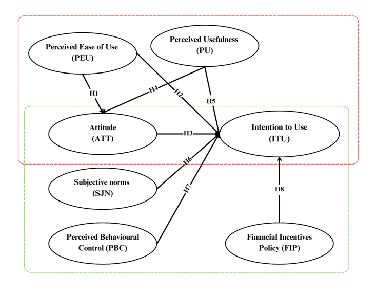
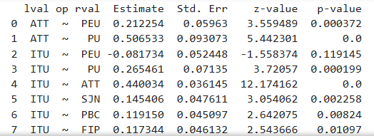
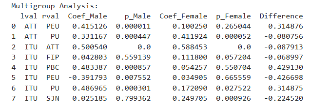

# Gender Differences in the Intention to Use Electric Cars: A Multigroup Analysis(Python)

This project explores the factors influencing consumer intention to use electric cars in Vietnam, based on predictors from the Technology Acceptance Model (TAM) and the Theory of Planned Behavior (TPB); together with an additional variable on financial incentives. It was conducted as part of an academic research project using survey data and statistical analysis in Python.

> **Note**: Raw data is excluded due to confidentiality. The notebook includes the full analysis pipeline for demonstration purposes.

## Objectives
- To explore psychological and behavioral factors affecting EV usage intention among Vietnamese consumers
- To apply existing constructs in EV literature in a quantitative model
- To explore the gender differences in consumer intention to buy ecars

## Methodology
- Survey-based data collection
- Data preprocessing: descriptive statistics & reliability (VÌ & factor loading)
- Structural Equation Modelling (SEM)
- Multigroup Analysis (MGA)

## Tools Used
- Python 3.x
- Libraries: 'pandas', 'numpy', 'semopy', 'statsmodels'
- Jupyter Notebook for analysis & visualization

## Key Insights
- At the 95% confidence level, all hypothesized paths were found to be statistically significant, except for the relationship between Perceived Ease of Use and Intention to Use

- MGA results indicate that men's Attitude towards electric cars is heavily influenced by their Perceived Ease of Use. Meanwhile, women's Attitude is more determined by Perceived Usefulness, but their actual Intention to Use is less influenced by this factor than that of men.
- Women's Intention to Use is also more influenced by their Attitude and Subjective Norms, while men's Intention to Use is more impacted by Perceived Behavioral Control. Both genders are not significantly impacted by Financial Intentives Policy.

## Files
- `electric_car_analysis.ipynb`: Full Jupyter Notebook with code and commentary
- `README.md`: Project overview
- *(Data not included)*

## About Me
I'm Phi Lam Nhi, a third-year economics student with interest in data analytics, market research, and statistical modeling.  
Feel free to connect on [LinkedIn](https://www.linkedin.com/in/l%C3%A2m-nhi-ph%C3%AD-52170831b/) or reach me at lamnhiphi04@gmail.com
